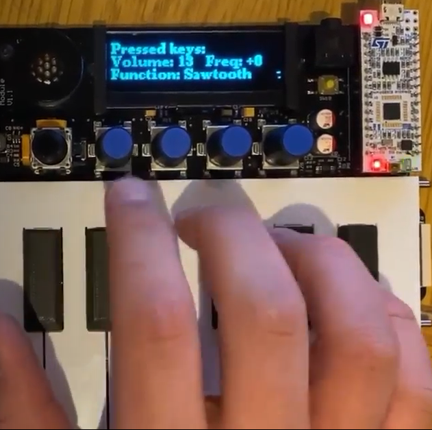

## Digital Piano

Within this coursework we were tasked with implementing a number of functional and non-functional specifications on a music synthesizer. We managed to successfully implement all of the core functions, as well as multiple interesting extra features to enhance functionality for the purpose of generating music.

### Polyphony

The first extra feature added was polyphony, which enables multiple notes to be played simultaneously. Specifically, we implemented this feature by allowing three keys to be played together and summing the outputs to generate different tones.

This task was implemented by lowering the maximum voltage a single key pressed can reach to ±32 from ±128. This means that if two keys are pressed the range becomes ±64 and if three keys are pressed ±96. That way if all three keys are pressed the Voltage would reach a maximum value of 224 (96+128) which is still lower than the maximum value of 225 that Arduino analogwrite() allows. This adjustment enables the user to experience all the different tones that polyphony can generate without having the output clipping.

Like all other extra features, polyphony was implemented to work across all three keyboards without compromising any of the core functional specifications. A short video showcasing the polyphony is shown in the Polyphony Video link below.

[Polyphony Video](https://drive.google.com/file/d/1br4ahsSOpLz666puIZmlDVTpBRQRuHu5/view?usp=sharing)

### Guitar Hero

This advanced feature is inspired by the famous *“Guitar Hero”* video game. The *Guitar Hero* video game shows the user keys on the screen which must be pressed on the guitar on specific instances and if they are pressed correctly and on the correct time frame, points are awarded. Similarly for the piano version the same concept was adapted. In guitar hero uses 4 different windows explained in the following text. A short video showing this extra feature is depicted in the Guitar Hero Video link below.

[Guitar Hero Video](https://drive.google.com/file/d/1KCEza5XFkuf_CEl8RuKQn2_ienB20qZE/view?usp=sharing)

1. *Introduction Window*: When the left most knob is pressed once, the user enters the introduction window and press it one more time to enters to the second window. 

2. *Selection Window*: By twisting Knob 0 the user can select from a variety songs which have different difficulties, from the following list: Happy birthday – Easy, C D E – Easy, Greek Song (“Ise theos ilios kalokerinos”) – Hard. The difficulty of the songs was based on how many sharp keys (i.e F#) were present as they can be troublesome for beginners. When the knob is pressed down again, the song is selected and the user is directed to the game.

3. *Game window*: Like the actual Guitar Hero game, the note is shown to the display of the user, and the user must make sure that it is pressed on the right time instance to receive a point and increase his score. The movement of the song Keys which must be played, is achieved by setting the horizontal axis of the cursor to the variable counter which like stated before, is incremented according to the frequency of the thread.
For short keys, meaning that the note will be pressed for a short period of time.
For long keys meaning that the piano key is pressed longer, a wider box is drawn.

4. *Score Window*: In the score window the user sees the score that he has achieved until he presses the knob again, in which case the Guitar Hero feature ends and the user exits back to the default window. 

