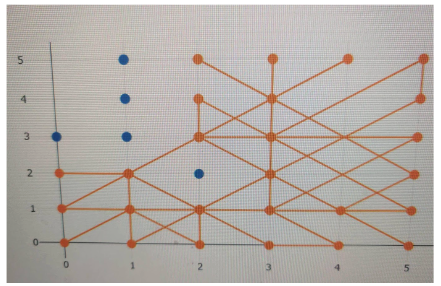
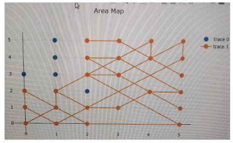
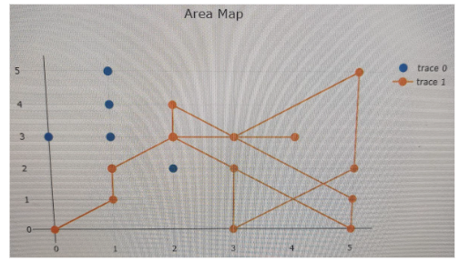

## Background
The second year project is called **Mars Rover**. We need to create a robot that can autonomously navigate and map an area. The
project is divided into 6 Modules and I am responsible for the Command Module.The command module of the autonomous rover system is mainly responsible for sending out movement commands and receiving status data from the rover. In the meantime, the command module also needs to build a map of the local working area using a database as required in the aim of the project. 
## How it works
To implement these functions of the command module, a web application is built using Python Flask that connects to ESP32 microcontroller using WebSocket protocol. Plotly.js, Bootstrap, A* algorithm and SQLAlchemy are also utilized features in different parts of the web server to support the functionality of the rover. 

The most interesting part of the project is constructing the mapping algorithm.The mapping algorithm is developed based on the A* algorithm. We have a search\_list which is a 2d array to keep track of which node is visited. Then we start to plan our path in the while loop until all of the selected area are visited. The algorithm will calculate the furthest coordinate in the area as we try to cover as many area as possible in the algorithm. If the path is available, we will travel to the coordinate. However, when we meet an obstacle in front of the rover, the rover would stop and register the obstacle in the database and recalculate the longest path again. If the path is not available, then the algorithm would conclude that that the node is not “reachable”(blocked by obstacles) and mark it as searched in the search\_list variable.

Although we have successfully mapped out all the obstacles in the map, the rover needs to travel a long path to execute the function which is not optimal. Hence we provide the extra “search\_list” variable to the A* algorithm and encourage the rover not to visit the nodes we have visited already by adding weight to them. The total travelling distance is reduced with the weighted map.

 However it is still quite a long distance to travel to map the area. Therefore, we would add a “surrounding\_check” function that checks if there are any obstacles in the neighbouring nodes before the recalculation. The result turns out to be great and the total travelling distance is greatly reduced. However, we are not sure if the amount of commands sent to the control is similar to the previous version but it could be improved by sending the surrounding check commands in bulk.

