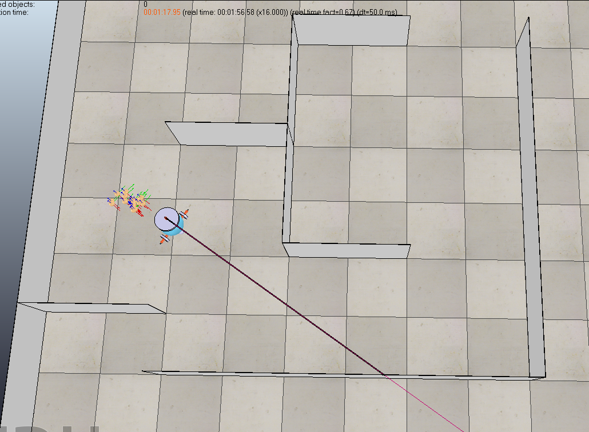

During the Robotics course, we need to use CoppeliaSim to program the robot to achieve certain objectives using algorithms learn in the class.
During the simulation, we cannot obtain information from the simulation scene other than the data from the sensors to recreate the real life sceanarios. 
Moreover, the floor is set to be bumpy in the scene to simulate the movement uncertainty in real life siutations. 
Hence, we cannot assume a forward direction command would lead to a perfect forward straight line and that's where the probalistic robotics comes in place to predict the uncertainty and making suitable adjustment.
The most challenging one is the last practical which we need to use monte carlo localisation to allow a robot to run on a complicated route multiple times with only one sensor.
We need to program the parts of the algorithm from scratch:
1. Motion Prediction based on Odometry
2. Measurement Update based on Sonar 
3. Normalisation
4. Resampling

As shown in the below image, the motion prediction is displayed as the yellow dots on the floor each with their own probability and the only sensor of the robot is shown 
as the laser in the image, measuring the distance between the robot and the wall in front of it. It is very fulfilling to see the robot and the algorithm working as it sometimes may derail from the desired positions but with the power of probability robotics it can autocorrect itself by only using one sensor!

